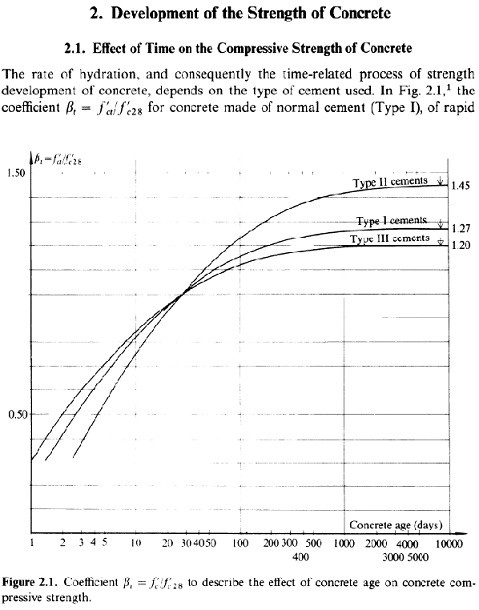

###### [home](/index.html)
# Concrete Testing Age

Concrete gains strength as it ages, as the cement in the mix gradually hydrates. The strength over time curve generally looks like the following:

\

The design strength of concrete, f'c, is generally defined as it's strength at 28 days. However, ACI lets you set any date you want for determining f'c. A longer curing time can be useful for high strength mixes, or mixes with a high percentage of slag or fly ash.

---

*From ACI 318-14:*

> 26.12.1.1 Compliance requirements:
(a) A strength test shall be the average of the strengths of at least two 6 x 12 in. cylinders or at least three 4 x 8 in. cylinders made from the same sample of concrete and tested at 28 days __or at test age designated for f'c.__

---

*From ACI 214 "Guide to Evaluation of Strength Test of Concrete":*

>6.4—Additional test requirements:
Normally, potential compressive strength and variability
of concrete are based on test results using cylinders that have
been sampled, molded, and standard cured in accordance
with ASTM C31/C31M until the specified test age, which is
normally 28 days. Test cylinder diameter should be at least
three times the size of the nominal maximum aggregate in
the mixture. Concrete specimens made or cured under
nonstandard conditions may provide additional information,
but should be analyzed and reported separately. Specimens
that have not been produced, cured, or tested under standard
conditions may not accurately reflect potential concrete
strength. Discrepancies and deviations from standard testing
conditions should be noted on strength test reports.

>__Concrete strength testing at later ages, such as 56, 91, or
182 days, may be more relevant than the 28-day strength,
particularly where a pozzolan, low heat cement, or cement of
slow strength gain is used.__ Some structural elements or
structures will not be loaded until concrete has matured longer
than 28 days and advantage can be taken of this strength gain.

---

[*NPCA: The 28-Day Myth*](https://precast.org/2013/10/28-day-myth/)

>A specified compressive strength may be for any strength at any age of concrete. There is nothing wrong with specifying 5,000-psi compressive strength at one, seven, 11, 14 or 56 days. It all depends on the mix design, circumstances and project requirements. The American Concrete Institute recognizes 28 days or “the test age designated for determination of the specified compressive strength.”

>...The 28-day time frame is not directly related to whether or not a specific product meets strength requirements for a particular application. As long as the minimum compressive strength is met before the product is put in service, the time frame to reach the minimum compressive strength should not be relevant.

###### *last updated: 5/5/20*