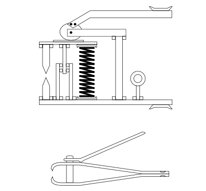

###### [home](/index.html)

# What Makes Something Easy to Manufacture?

#### Notes on the Design for Manufacturability Handbook

[The Design for Manufacturability Handbook](https://www.amazon.com/Design-Manufacturability-Handbook-James-Bralla/dp/007007139X), by James Bralla, is a reference on how to manufacture things as efficiently (read: cheaply) as possible. It covers a broad swath of tooling strategies, processes, material components, fasteners, fabrication processes, and assembly techniques.

My interest was mostly on best practices that could be applied to fabrication in general, and I skipped most of the chapters on specific things like die-casting, machining, or heat treating.

---

So what makes something easy to manufacture? In between discussions of injection molding and arc welding, Bralla makes a variety of suggestions:

### Minimize the number of manufacturing operations

The number of manufacturing operations required to complete a part probably is the greatest single determinant of direct labor cost. The higher the cost of something, generally, the more difficult it will be to manufacture, and the more labor it will take.

### Minimize the number of parts required
 
Every part created has a number of costs associated with it. Eliminating new parts eliminated those costs. Combine parts if possible. Parts that move, must be made of different materials, or would make assembly more difficult are bad candidates for being combined. Try to combine right and left handed parts. Use sub assemblies.

### Minimize the number of *new* parts required

Creating something new requires creating an entire set of operations around designing it, optimizing it, checking it, learning it, supporting it, ordering it, fitting it in with the rest of your operations. Standardized parts that you have already created, or off-the-shelf parts that can be easily purchased and are already designed and tested, are far better than custom components. Standardization should encompass all aspects of the process - drawings, design features (sizes, etc.) procedures, processes, materials, etc.

### Involve manufacturing as early as possible in the design process

The earlier manufacturing is involved, the more they'll be able to suggest efficient strategies; the later they're involved, the more difficult it will be to change design direction. Make manufacturing integral to the design process rather than an afterthought. Wherever possible provide performance specs instead of process requirements; allow manufacturing determine the optimal operations.

### Don't use custom tooling unless you have large production volumes

Tooling is expensive, and can generally only be justified by amortizing over a large production volume. The smaller your production volume, the less specialized tooling can be justified. Large production volumes can also more easily justify the expense non-standardized items. (more volume = can amortize costs over a larager number of items)

### Focus on ease of assembly

Often final assembly of a product is the most expensive operation. Designing for assembly, ie: simplifying the product so it has fewer parts, and can be put together with fewer and simpler operations, can confer significant benefits. Optimization at this level should thus be done first. Then, once you know what parts will actuall exist, can you optimize the remaining portion.

Design parts so they cannot be inserted incorrectly. *BONUS:* design parts so they can be inserted correctly in multiple different ways. Parts should nest within each other where possible, or otherwise fit together to make them "self aligning". Use tapers, shoulders, notches, funnels, etc. The tighter the tolerances required, the more difficult (and expensive) to manufacture. The greater the tolerances and fits, the better.

Use parts that won't get tangled or stuck (simple shapes, no flexible components). Design so assembly can proceed with simple motions, and doesn't require complex maneuvers (being placed from the top down is best). Make parts easy to pick up and handle.

It typically takes a production volume in the millions to justify fully automatic assembly. But designing for automatic assembly will generally make manual assembly easier as well.

###### *last updated: 03/23/19*