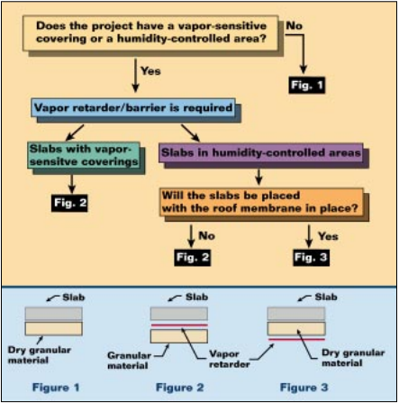

###### [home](/index.html) > [Structural Systems](/structuralsystems.html)

#### Vapor Barriers

When pouring a concrete slab on grade, a vapor barrier is generally placed below the slab. This is a thin sheet of material (generally polyethylene) which prevents moisture from migrating through the slab.

Much of the information on where to place the vapor barrier is conflicing, as can be seen below.

---

#### [eng-tips thread](https://www.eng-tips.com/viewthread.cfm?qid=45488)

> Vapor barriers are suggested to be used where flooring material over the slab on grade is moisture sensitive.  As for warehouses where floor may be just bare concrete, vapor barriers may be omitted. 

> The 2" layer of sand below the vapor barrier is to ensure that the membrane doesn't puncture (due to rough surface of subgrade).  2" sand above the vapor barrier is to avoid wet concrete to be in direct contact with the membrane.

>There is a need to provide a 'slip membrane' below all large concrete slabs. Together with preventing damp ingress into the building it will also allow the slab to shrink evenly by removing the friction between the sub grade and the concrete. Thin slabs will crack to hell if it is not in place, even with reinforcement. It must be used! 

>For large slabs on grade, the vapor barrier does nothing to control cracking.  This is done by appropriate thickness control and jointing.  Yes, the vapor barrier does provide some relief of friction restraint, but again, this can be overcome by appropriate thickness control and jointing.

#### [Stego Guide on Vapor Barrier Placement](https://www.stegoindustries.com/hubfs/Technical_Articles/WhereToPlaceTVR.pdf)

#### [ACI 302 Chapter 5](https://www.concrete.org/Portals/0/Files/PDF/302.1R-15_Chapter5.pdf)

> A vapor retarder/barrier is a material that is intended to minimize the transmission of water vapor upward through the slab from sources below. The performance requirements for plastic vapor retarder/barrier materials in contact with soil or granular fill under concrete slabs are listed in ASTM E1745. According to ASTM E1745 a vapor retarder/barrier material is to have a permeance level, also known as the water vapor transmission rate, not exceeding 0.1 perms as determined by ASTM E96/E96M or ASTM F1249. However, most flooring installations will benefit by using a material with a permeance level well below 0.1 perms (0.0659 metric perms = 5.72 ng/s–1m–2Pa–1). The selection of a vapor retarder/barrier material and its level of permeance should be made on the basis of theprotective requirements of the material being applied to the floor surface or the environment being protected. Although conventional 6, 8, and 10 mil (0.15, 0.20, and 0.25 mm) polyethylene has been used in the past, this class of material does not fully conform to the requirements of ASTM E1745 and should not be considered for use as below-slab moisture protection. Any plastic vapor retarder/barrier material to be used below slabs should be in full compliance with the minimum requirements of ASTM E1745 and the thickness and permeance of the material be selected on the basis of protective needs and durability during andafter installation. However, for a material to be considered a true barrier it would need to have a permeance level of 0.0 perms when tested in accordance with ASTM E96/E96M or ASTM F1249. The industry has not established a permeance level that serves as the dividing point between materials classed as vapor barriers or vapor retarders. It is most likely that when a dividing point between barrier and retarder is established it will be at 0.01 perms or less. The laps or seams for a vapor retarder/barrier should be overlapped 6 in. (150 mm)(ASTM E1643) or as instructed by the manufacturer. Joints and penetrations should be sealed with the manufacturer’s recommended adhesive, pressure-sensitive tape, or both.

> The decision to locate the vapor retarder/barrier in direct contact with the slab’s underside had long been debated. Experience has shown, however, that the greatest level of protectionfor floor coverings, coatings, or building environments is provided when the vapor retarder/barrier is placed in direct contact with the slab. Placing concrete in direct contact with the vapor retarder/barrier eliminates the potential for water from sources such as rain, saw-cutting, curing, cleaning, or compaction to become trapped within the fill course. Wetor saturated fill above the vapor retarder/barrier can significantly lengthen the time required for a slab to dry to a level acceptable to the manufacturers of floor coverings, adhesives, and coatings. A fill layer sandwiched between the vapor retarder/barrier and the concrete also serves as an avenue for moisture to enter and travel freely beneath the slab, which can lead to an increase in moisture within the slab once it is covered. Moisture can enter the fill layer through voids,tears, or punctures in the vapor retarder/barrier. Placing concrete in direct contact with the vapor retarder/barrier requires additional design and construction considerations if potential slab-related problems are to be avoided. When compared with identical concrete cast on a draining base, concrete placed in direct contact with a vapor retarder/barrier shows more settlement and exhibits significantly larger length change in the first hour after casting, during drying shrinkage, and when subject to environmental change (Suprenant 1997). Joints that open wider than what is normally anticipated are called dominant joints (Walker and Holland 2007). Dominant joint behavior can be made worse when the slab is placed in direct contact with a vapor retarder/barrier that reduces friction from the base. Where reinforcing steel is present, settlement cracking over the steel is more likely because of increased settlement resulting from a longer bleeding period. There is also increased potential for a greater measure of slab curl. Concrete that does not lose excess water to the base does not stiffen as rapidly as concrete that does. If rapid surface drying conditions are present, the surface of concrete placed directlyon a vapor retarder/barrier has a tendency to dry and crust over whereas the concrete below the top fraction of an inch (millimeter) remains relatively less stiff or unhardened. When this occurs, it may be necessary to begin machine operations on the concrete surface before the concrete below the top surface is sufficiently set. Under such conditions, a reduction in surface flatness and some blistering or delamination can occur as air,water, or both, become trapped below the finish surface.Each proposed installation should be independently evaluated for moisture sensitivity of anticipated subsequent floor finishes and the level of protection and material strength they might need. When placing concrete in direct contact with the vapor retarder/barrier, the potential effects of slab curling, crusting, and cracking should be considered. Design and construction measures should be implemented to offset or to minimize these effects. The anticipated benefits and risks associated with the specified location of the vapor retarder/barrier should be reviewed (Fig. 5.2.3.2) with all parties before construction

#### [BSC - Concrete Floor Problems](https://www.buildingscience.com/documents/insights/bsi-003-concrete-floor-problems)

On the necessity of protecting the vapor barrier from holes or rips:

> The polyethylene does not need protecting. You can poke holes in it, you can puncture it, you can tear it, you can leave gaps in it, and pretty much have your way with it as long as it is in direct contact with the concrete. Huh?  But, but, vapor barriers have to be continuous and free from any holes. Actually, no. Air barriers need to be continuous and free from holes, but vapor barriers do not need to be. Lots of vapor moves by air movement, not a heck of a lot of vapor moves by vapor diffusion. The concrete slab is the air barrier, and the ripped and torn and punctured polyethylene sheet is the vapor barrier. It’s that Fick’s Law thing. Diffusion is a direct function of surface area—if I get 95 percent of the surface covered I am pretty much 95 percent effective—and the parts that are left I have filled with concrete which is also pretty good as a vapor barrier.

### Other Resources:

- [WR Meadows whitepaper](https://www.wrmeadows.com/white-paper-under-slab-vapor-barriers-retarders/)

###### *last updated: 05/03/20*

